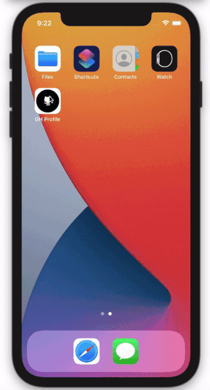
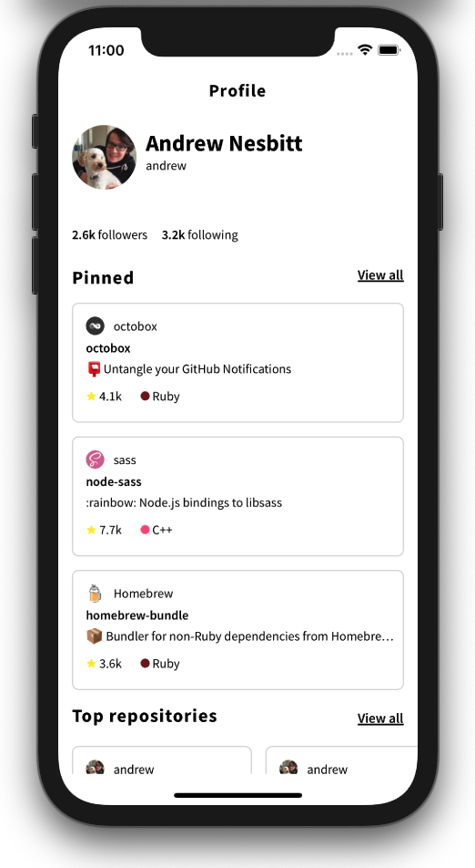

# GH Profile

GH Profile is a usage demonstration of ****GitHub Graph QL API**** written in Swift.

- [Features](#features)
- [Technical Information](#technical-information)
- [Requirements](#requirements)
- [How to run](#how-to-run)
- [Modifications](#modifications)
- [Create your own API key](#create-your-own-api-key)

## Features
- [x] Display main user information. Such as profile picture, name, login, email, followers count, following count.
- [x] Top 3 pinned repositories
- [x] Top 10 user repositories
- [x] Top 10 starred repositories

## Technical Information

- [x] Developed using MVP(Model-View-Presenter) architecture
- [x] No storyboards used
- [x] No third-party libraries used
- [x] Cache data for 1 day and pull to force a refresh

 
## Requirements

- iOS 11.0+
- Xcode 12+
- Swift 5+

## How to run
Just check out the project, open using Xcode, and hit the "build and run" button. That's it!

## Modifications
Please refer *****_Constants.swift_***** file for common configurations, Including GitHub profile to load and API key for GitHub Graph QL.

## Create your own API key

Please refer below instructions to generate your own API key.

[Creating a personal access token](https://docs.github.com/en/github/authenticating-to-github/creating-a-personal-access-token)
